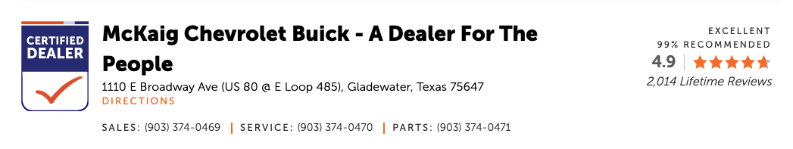
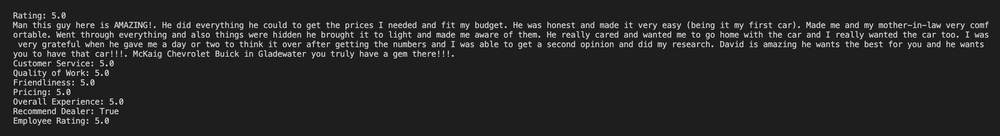

# dealer-scrape
Scrapes dealer reviews and identifies those most "overly positive", as defined below.

1. Scrapes the first five pages of reviews of McKaig Chevrolet Buick on DealerRater.com.

2. Identifies the top three most “overly positive” endorsements (criteria below).

3. Outputs these three reviews to the console, in descending order of positivity score.

# How to run dealer-scrape
Figuring out how to package it up, but in the meantime you can:
1. Install python3
2. pip install requests_html
3. Navigate to main.py directory and run 'python3 main.py'

# What makes a review overly positive?
A review is given a positivity score based on the sum of the following points system. 
The minimum score is 0, and the maximum is 100.

## 1. Overall Rating: 25 points
#### The overall rating of the review, out of 5 stars, multiplied by 5.
- A rating of 0 stars results in a score of 0 for this section.
- A rating of 1 star results in a score of 5 for this section.
- ...
- A rating of 5 stars results in a score of 25 for this section.
## 2. Subratings and Recommendation: 25 points
#### The sum of each subrating from the review, each out of 5 stars, divided by 2 if the dealer is not recommended.
- A Customer Service rating of 5 stars adds 5 to the score for this section.
- A Quality of Work rating of 4 stars adds 4 to the score for this section.
- ...
- If the dealer is recommended, leave this section's score as-is. If the dealer is not recommended, divide this section's summed score by 2.
## 3. Employee Ratings: 25 points
#### The number of employee reviews, relative to the other reviews processed, scaled to 5, then scaled by the average positivity of the employee reviews.
- No employee reviews results in a score of 0 for this section.
- If a review has the maximum number 10 of employee ratings of all processed reviews, and they are all 5 star ratings, the score for this section is (10/10 * 25) * 5/5 = 25.
- If a review has 5 employee ratings, but the maximum number of employee ratings of all processed reviews is 10, and they are all 4 star ratings, the score for this section is (5/10 * 25) * 4/5 = 10.
## 4. Review Body Length: 25 points
#### Number of words in the review, relative to the maximum number of words from the other reviews processed.
- If a review body has the maximum number of words of all processed reviews, the score for this section is 25.
- If the maximum number of words in other review bodies is 100, and a review body has only 10 words, this section's score for that review will be 25 * 10/100 = 2.5.